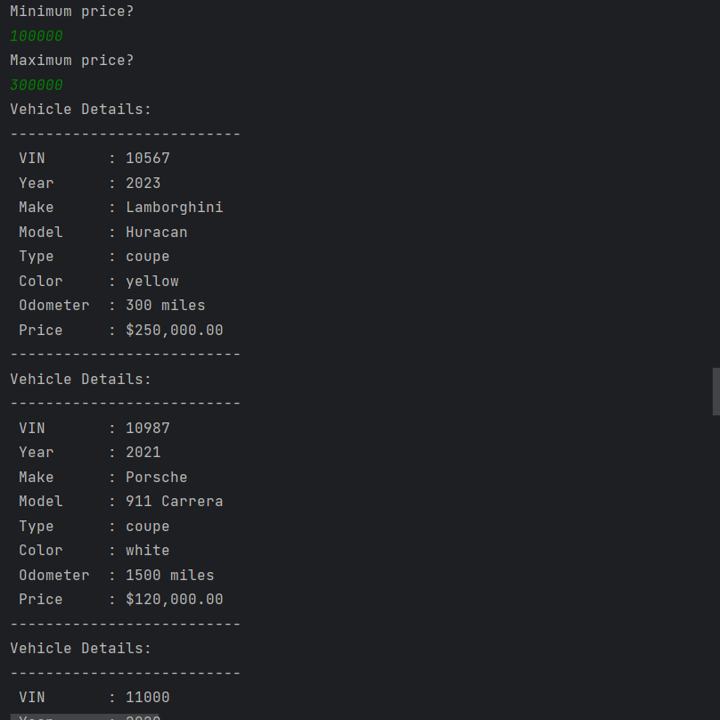

# Dealership Application

## Description of the Project

My dealership application gives users the ability to filter search through dealerships inventories. Each filter will allow for the users to give the console their search requirements and will be shown vehicles according to that.

## User Stories

-As a user I would like to be able to remove vehicles from inventory.
-As a user I would like to be able to search within a certain price range. This will save me time from looking through the whole inventory.
-As a user I would like to be able to search only by the make and model of vehicles. This will save the time of looking at cars I don't want.
-As a user I would like to be able to search within a certain year range.
-As a user I would like to be able to add vehicles into the inventory.
-As a user I would like to be able to see all the vehicles without having any filters applied.
-As a user I would like to be able to search for vehicles that have a certain number of miles.
-As a user I would like to be able to search for vehicles by the type (car,truck,SUV,van).

## Setup

The application while ask for an input with corresponding action. Once given an input it will display a filtered version o the inventory or will prompt to add or remove vehicle.

### Prerequisites

- IntelliJ IDEA: Ensure you have IntelliJ IDEA installed, which you can download from [here](https://www.jetbrains.com/idea/download/).
- Java SDK: Make sure Java SDK is installed and configured in IntelliJ.

### Running the Application in IntelliJ

Follow these steps to get your application running within IntelliJ IDEA:

1. Open IntelliJ IDEA.
2. Select "Open" and navigate to the directory where you cloned or downloaded the project.
3. After the project opens, wait for IntelliJ to index the files and set up the project.
4. Find the main class with the `public static void main(String[] args)` method.
5. Right-click on the file and select 'Run 'YourMainClassName.main()'' to start the application.

## Technologies Used

- IntelliJ IDEA Community Edition 2022.3.2

## Demo

Include screenshots or GIFs that show your application in action. Use tools like [Giphy Capture](https://giphy.com/apps/giphycapture) to record a GIF of your application.

 7.
 1.
4.
6.

## Future Work

- want to be able to add new dealerships and add their csv files.
- Would like to prompt users to select what dealership inventory they would like to look at.

## Resources

List resources such as tutorials, articles, or documentation that helped you during the project.

- https://github.com/users/Devinswil/projects/4/views/1?pane=issue&itemId=84838191
- https://github.com/RayMaroun

## Team Members

n/a

## Thanks

- Thank you to Raymond for continuous support and guidance.
